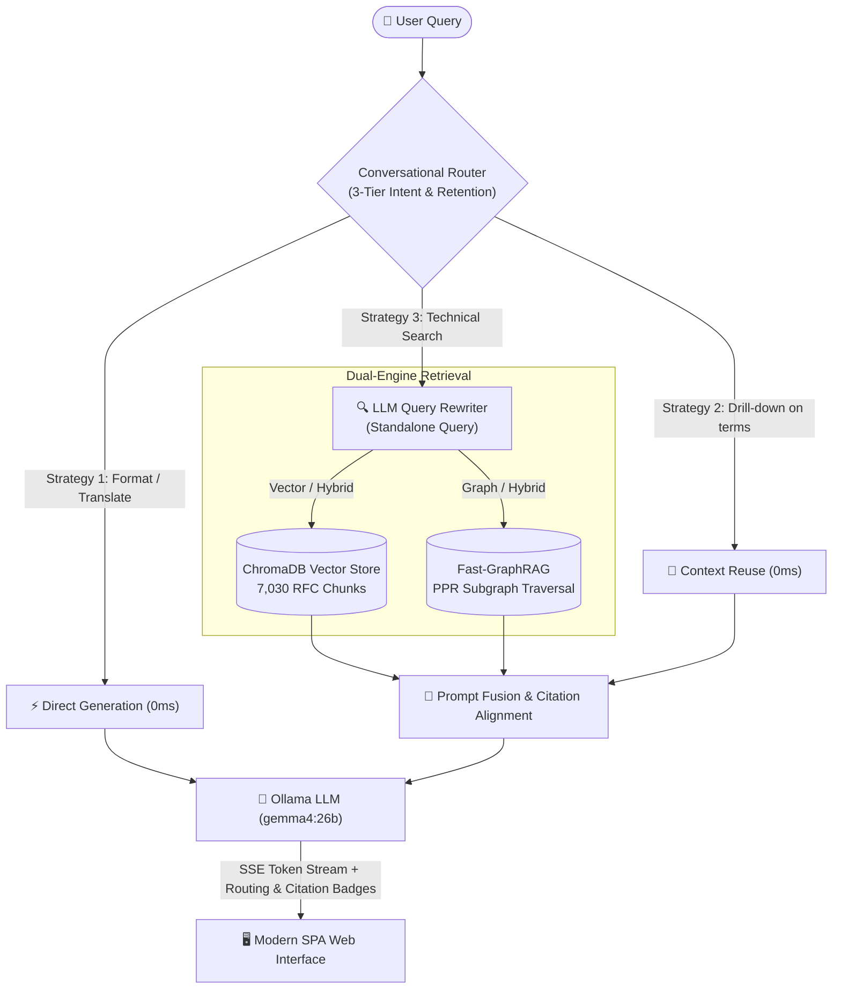

# IPv6 RAG Hub 🌐

[**繁體中文**](./README.zh-TW.md) | **English**

An intelligent, production-ready Dual-Engine Retrieval-Augmented Generation (RAG) platform tailored for IPv6 protocol specifications. Backed by **153 official IETF RFC documents** from the **6man** (IPv6 Maintenance) and **v6ops** (IPv6 Operations) working groups, providing strictly grounded answers with verifiable section citations.

---

## ✨ Key Features

- **Dual-Engine Retrieval (Vector + Fast-GraphRAG)**:
  - **Vector RAG**: ChromaDB semantic search over section-aware RFC chunks (7,030 chunks) via 768-dim embeddings (`embeddinggemma:latest`).
  - **Fast-GraphRAG**: In-memory knowledge graph (840 nodes, 3,094 edges) with Personalized PageRank (PPR) random-walk traversal across protocol evolution relations (`OBSOLETES`, `UPDATES`, `DEFINES`, `USES`, `EXTENDS`).
  - **Hybrid Fusion**: Real-time multi-mode selector (`📊 向量`, `🕸️ 圖譜`, `⚡ 混合`) combining micro technical text with macro relational evolution.
- **Smart Conversational Router & Memory**:
  - **Strategy 1 (Zero-RAG)**: Detects formatting, translation, or polite chitchat to respond instantly without retrieval (`⚡ 對話直連`).
  - **Strategy 2 (Context Reuse)**: Detects drill-downs into previous answers (e.g. "詳細解釋第 2 點", "上面提到的 Hop Limit") and reuses existing context with 0ms search overhead (`🔄 沿用上下文`).
  - **Strategy 3 (LLM Query Rewriting)**: Restores ambiguous follow-up pronouns (e.g. "那它廢棄了什麼？") into standalone technical search queries before retrieval (`🔍 獨立檢索焦點`).
- **Strict Factual Citations & Provenance**: Every answer provides precise RFC citations (`[RFC <number> Section <sec>]`) along with interactive citation badges linking directly to the IETF Datatracker and excerpt inspector.
- **Zero-Config Automatic Vector Store Initialization**: 
  - Automatically indexes ChromaDB and Knowledge Graph upon initial setup, with incremental syncing and pruning on startup.
- **Dynamic Ollama Settings**:
  - Customize Ollama Base URL, API Bearer Token, Chat LLM (`gemma4:26b`, `qwen3.6:27b`), and Embedding model directly from the UI with built-in connection testing.
- **Real-Time Streaming SPA**:
  - Interactive chat interface with Server-Sent Events (SSE) token streaming, real-time Markdown rendering, dark/light theme switching, and built-in RFC Explorer.

---

## 🏗️ Architecture



---

## 🚀 Quick Start

### Prerequisites

- Python 3.10+
- [`uv`](https://github.com/astral-sh/uv) (recommended package manager)
- An active [Ollama](https://ollama.com/) instance (local or remote) with models installed:
  - Completion model: `gemma4:26b` (or `qwen3.6:27b`, `llama3`, etc.)
  - Embedding model: `embeddinggemma:latest` (or `mxbai-embed-large:latest`)

### 1. Clone & Setup

```bash
git clone https://github.com/dbshadow/RAG-IPv6.git
cd RAG-IPv6

# Install dependencies using uv
uv sync
```

### 2. (Optional) Re-scrape or Re-index

*Pre-downloaded RFCs (`data/rfcs/`) and Graph Data (`data/graph/`) are included.*

```bash
# Re-download RFCs
uv run python scripts/download_rfcs.py

# Re-build Knowledge Graph index
uv run python scripts/index_graph.py
```

### 3. Run the Application

```bash
uv run uvicorn app.main:app --host 0.0.0.0 --port 8000
```

> **Note**: On first launch, the server automatically initializes ChromaDB vector embeddings in the background.

Open your browser and navigate to:
👉 **`http://localhost:8000`**

---

## ⚙️ Configuration

You can configure default parameters via environment variables or directly inside the Web UI settings modal:

| Variable | Description | Default |
|---|---|---|
| `OLLAMA_BASE_URL` | Ollama service endpoint URL | `https://llm.ainvc.i234.me` |
| `OLLAMA_API_TOKEN` | Bearer Token for reverse proxy auth | *(Configured default token)* |
| `OLLAMA_CHAT_MODEL` | Default LLM generation model | `gemma4:26b` |
| `OLLAMA_EMBED_MODEL` | Default Embedding model | `embeddinggemma:latest` |

---

## 📡 API Overview

- `POST /api/chat/stream`: Stream multi-turn answer tokens via Server-Sent Events (SSE) with routing decision and citation events.
- `POST /api/chat`: Standard JSON Q&A response with multi-turn history and routing metadata.
- `GET /api/graph/stats`: Retrieve Fast-GraphRAG statistics (node count, edge count, relation distributions).
- `POST /api/ollama/models`: Proxy endpoint to fetch and categorize available models from any target Ollama server.
- `GET /api/rfcs`: Retrieve list and metadata of all 153 official RFCs.
- `GET /api/rfcs/{rfc_id}`: Retrieve the full text and metadata for a specific RFC.
- `GET /api/health`: System health status, indexed chunk counts, and live sync progress.

---

## 📄 License

MIT License. See [LICENSE](./LICENSE) for details.
