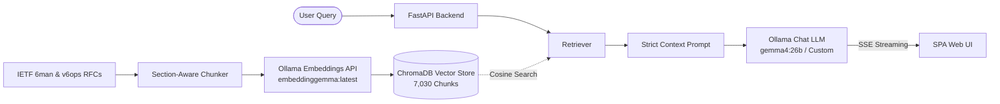

# IPv6 RAG Hub 🌐

[**繁體中文**](./README.zh-TW.md) | **English**

An intelligent, production-ready Retrieval-Augmented Generation (RAG) platform tailored for IPv6 protocol specifications. Backed by **153 official IETF RFC documents** from the **6man** (IPv6 Maintenance) and **v6ops** (IPv6 Operations) working groups, providing strictly grounded answers with verifiable section citations.

---

## ✨ Key Features

- **Strict Factual Citations & Provenance**: Every answer provides precise RFC citations (`[RFC <number> Section <sec>]`) along with interactive citation badges linking directly to the IETF Datatracker and excerpt inspector.
- **Zero-Config Automatic Vector Store Initialization**: 
  - **Cold-Start Automation**: Automatically parses, chunks, and embeds all RFCs into ChromaDB upon the very first server launch.
  - **Incremental Sync & Pruning**: On every startup, changes in `data/rfcs/` are automatically detected—new/modified RFCs are embedded incrementally, and deleted RFCs are pruned from the vector store.
- **Dynamic Ollama Settings**:
  - Customize Ollama Base URL (remote or local instance), API Bearer Token, Chat LLM (e.g. `gemma4:26b`, `qwen3.6:27b`), and Embedding model directly from the UI.
  - Built-in connection tester and model auto-discovery via backend proxy.
- **Real-Time Streaming SPA**:
  - Full-height interactive chat interface with Server-Sent Events (SSE) token streaming and real-time Markdown rendering.
  - Sleek Dark / Light theme toggle with persisted user preference.
  - Built-in RFC Explorer with search across all 153 official RFC documents.

---

## 🏗️ Architecture



---

## 🚀 Quick Start

### Prerequisites

- Python 3.10+
- [`uv`](https://github.com/astral-sh/uv) (recommended package manager)
- An active [Ollama](https://ollama.com/) instance (local or remote) with models installed:
  - Completion model: `gemma4:26b` (or `qwen3.6:27b`, `llama3`, etc.)
  - Embedding model: `embeddinggemma:latest` (or `mxbai-embed-large:latest`)

### 1. Clone & Setup

```bash
git clone https://github.com/your-username/RAG-IPv6.git
cd RAG-IPv6

# Install dependencies using uv
uv sync
```

### 2. (Optional) Download RFC Documents

*Pre-downloaded RFC documents and metadata are already included in `data/rfcs/` and `data/metadata.json`.* If you want to re-scrape:

```bash
uv run python scripts/download_rfcs.py
```

### 3. Run the Application

```bash
uv run uvicorn app.main:app --host 0.0.0.0 --port 8000
```

> **Note**: On the first launch, the server automatically initializes the ChromaDB vector database in the background.

Open your browser and navigate to:
👉 **`http://localhost:8000`**

---

## ⚙️ Configuration

You can configure default connection parameters via environment variables or directly inside the Web UI settings modal:

| Variable | Description | Default |
|---|---|---|
| `OLLAMA_BASE_URL` | Ollama service endpoint URL | `https://llm.ainvc.i234.me` |
| `OLLAMA_API_TOKEN` | Bearer Token for reverse proxy auth | *(Configured default token)* |
| `OLLAMA_CHAT_MODEL` | Default LLM generation model | `gemma4:26b` |
| `OLLAMA_EMBED_MODEL` | Default Embedding model | `embeddinggemma:latest` |

---

## 📡 API Overview

- `POST /api/chat/stream`: Stream answer tokens via Server-Sent Events (SSE) with dynamic Ollama configuration.
- `POST /api/chat`: Standard JSON Q&A response with citation metadata.
- `POST /api/ollama/models`: Proxy endpoint to fetch and categorize available models from any target Ollama server.
- `GET /api/rfcs`: Retrieve list and metadata of all 153 official RFCs.
- `GET /api/rfcs/{rfc_id}`: Retrieve the full text and metadata for a specific RFC.
- `GET /api/health`: System health status, indexed chunk counts, and live sync progress.
- `POST /api/rfcs/sync`: Manually trigger incremental or force re-synchronization.

---

## 📄 License

MIT License. See [LICENSE](./LICENSE) for details.
