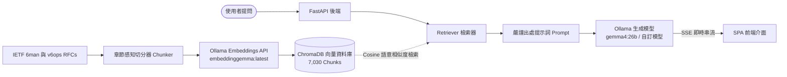

# IPv6 RAG Hub 🌐

**繁體中文** | [**English**](./README.md)

專為 IPv6 網路協定規範打造的檢索增強生成（RAG）智慧問答平台。收錄來自 IETF **6man**（IPv6 Maintenance 核心規範）與 **v6ops**（IPv6 Operations 營運實務）工作組的 **153 篇正式 RFC 文件**，提供嚴謹、有據可查且精確標註章節出處的 IPv6 專業解答。

---

## ✨ 核心特色

- **嚴謹文獻引用與出處佐證**：每一則回答皆標註精確的 RFC 出處（如 `[RFC 8200 Section 3]`），並提供可互動點擊的引用徽章，一鍵展開引文片段與查看 IETF Datatracker 官網原文。
- **零配置啟動與自動向量同步**：
  - **首次啟動自動化**：第一次啟動伺服器時，若偵測到向量庫為空，將自動在背景非同步切分並建立 ChromaDB 向量索引（無須手動執行腳本）。
  - **增量同步與自動清理**：每次啟動時自動掃描 `data/rfcs/` 資料夾，僅對新增或修改的 RFC 進行增量 Embedding，並自動自向量庫中清理已刪除文件的向量。
- **動態自訂 Ollama 連線與模型**：
  - 前端提供設定彈窗，支援自訂 Ollama 連線位址（遠端或本地）、API Bearer Token、Chat 問答模型（如 `gemma4:26b`、`qwen3.6:27b`）以及 Embedding 嵌入模型。
  - 內建連線測試與可用模型自動獲取/分類功能（透過後端 Proxy 繞過 CORS 限制）。
- **即時串流與現代化 SPA 介面**：
  - 滿版對話介面，採用 Server-Sent Events (SSE) 實現極速即時 Token 串流與 Markdown 即時渲染。
  - 簡約深灰 (Dark) / 明亮 (Light) 主題一鍵切換，並自動持久化使用者喜好。
  - 內建 RFC 典藏庫檢視器，支援即時關鍵字搜尋與篩選 153 篇 RFC。

---

## 🏗️ 系統架構



---

## 🚀 快速開始

### 環境需求

- Python 3.10+
- [`uv`](https://github.com/astral-sh/uv)（推薦的 Python 套件管理工具）
- 運作中的 [Ollama](https://ollama.com/) 服務（本地或遠端），並具備相應模型：
  - 生成模型：`gemma4:26b`（或 `qwen3.6:27b`、`llama3` 等）
  - 嵌入模型：`embeddinggemma:latest`（或 `mxbai-embed-large:latest`）

### 1. 複製專案與安裝依賴

```bash
git clone https://github.com/your-username/RAG-IPv6.git
cd RAG-IPv6

# 使用 uv 安裝虛擬環境與依賴套件
uv sync
```

### 2. (選填) 下載 RFC 文件

*專案中已預先收錄完整的 153 篇 RFC 純文字文件於 `data/rfcs/` 及 `data/metadata.json`。* 若需重新抓取：

```bash
uv run python scripts/download_rfcs.py
```

### 3. 啟動應用程式

```bash
uv run uvicorn app.main:app --host 0.0.0.0 --port 8000
```

> **注意**：首次啟動時，系統將自動於背景非同步建立向量資料庫。

開啟瀏覽器前往：
👉 **`http://localhost:8000`**

---

## ⚙️ 系統設定

可透過環境變數或直接於 Web 前端設定彈窗進行調整：

| 環境變數 | 說明 | 預設值 |
|---|---|---|
| `OLLAMA_BASE_URL` | Ollama 服務 API 位址 | `https://llm.ainvc.i234.me` |
| `OLLAMA_API_TOKEN` | 反向代理驗證用 Bearer Token | *(預設內建 Token)* |
| `OLLAMA_CHAT_MODEL` | 預設問答生成模型 | `gemma4:26b` |
| `OLLAMA_EMBED_MODEL` | 預設向量嵌入模型 | `embeddinggemma:latest` |

---

## 📡 API 介面一覽

- `POST /api/chat/stream`：透過 SSE 串流傳回問答內容與引用清單（支援動態 Ollama 參數）。
- `POST /api/chat`：標準 JSON 格式問答回應與出處元資料。
- `POST /api/ollama/models`：代理查詢目標 Ollama 伺服器之可用模型清單。
- `GET /api/rfcs`：取得全部 153 篇 RFC 清單與元資料（支援 WG 與關鍵字篩選）。
- `GET /api/rfcs/{rfc_id}`：取得特定 RFC 之完整純文字內容。
- `GET /api/health`：系統健康狀態、向量數量與即時同步進度。
- `POST /api/rfcs/sync`：手動觸發增量或全量向量資料庫同步。

---

## 📄 授權條款

MIT License. 詳情請參閱 [LICENSE](./LICENSE)。
